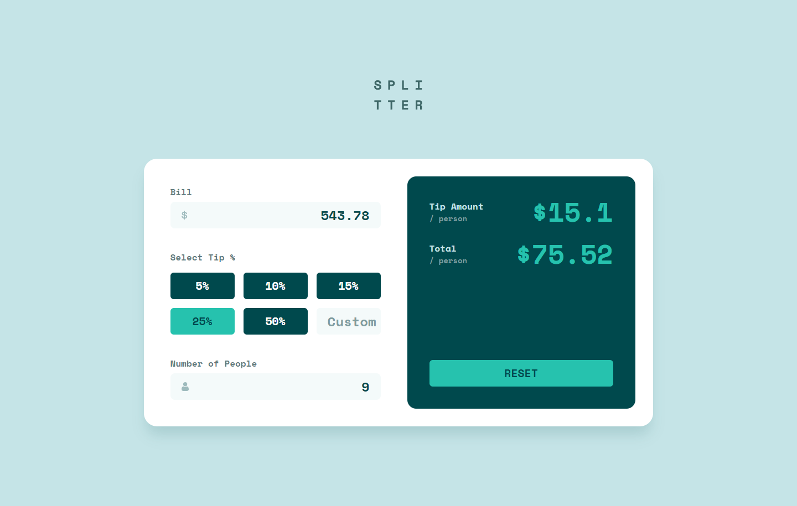
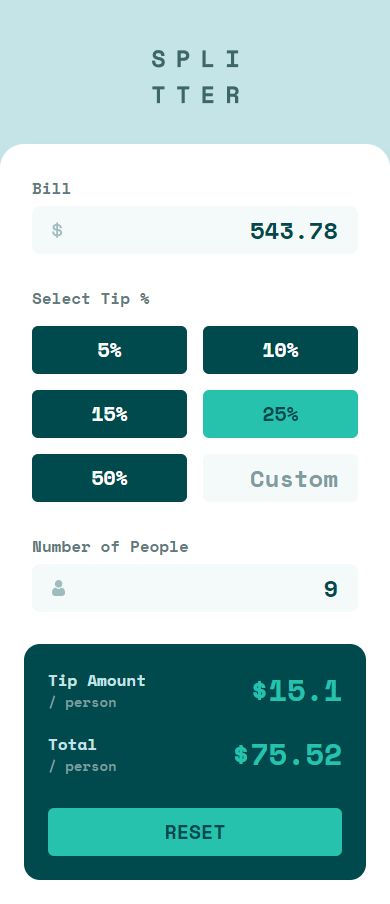

# Frontend Mentor - Tip calculator app solution

This is a solution to the [Tip calculator app challenge on Frontend Mentor](https://www.frontendmentor.io/challenges/tip-calculator-app-ugJNGbJUX). Frontend Mentor challenges help you improve your coding skills by building realistic projects.

## Overview

### Screenshot

#### Desktop size:

#### Mobile size:

### Links

- Solution URL: [https://github.com/fasterv410/tip-calculator](https://github.com/fasterv410/tip-calculator)
- Live Site URL: [https://fasterv410.github.io/tip-calculator](https://fasterv410.github.io/tip-calculator)

## My process

### Built with

- [TailwindCSS](https://tailwindcss.com/)
- [Vuejs](https://vuejs.org/)
- Semantic HTML5 markup

### What I learned

- Flexbox
- TailwindCSS
- Centering elements
- Vuejs
- Composition API

## Author

- Frontend Mentor - [@fasterv410](https://www.frontendmentor.io/profile/fasterv410)
- Github - [fasterv410](https://github.com/fasterv410)